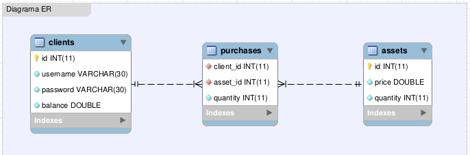

	
	

# Desafio de Back-end - PSel XP/Trybe

## Descrição
- O desafio apresenta uma aplicação de investimento em ações com algumas funcionalidades de conta digital.

## Funcionalidades

## Decisões
- O README está em português. O código e os commits estão em inglês.
- O projeto foi desenvolvido em TypeScript para garantir a tipagem estática e forte, promovendo um código mais seguro e mais fácil de refatorar (além do autocomplete :sweat_smile:)
- Decidi não utilizar ORM para demonstrar o domínio na criação direta de tabelas no MySQL e no uso das queries
- Decidi não usar TDD, pois priorizei os requisitos mínimos na fase de levantamento (testes unitários são requisitos adicionais)
- Usei ESLint para padronizar o código -> maior legibilidade e facilita a identificação de erros/problemas durante o desenvolvimento
- Dockerizei a aplicação para que ela funcione em qualquer ambiente

## Como rodar
1. Clone o repositório
- SSH: `git clone git@github.com:lucasdvilar/psel-xp.git`
- HTTPS: `git clone https://github.com/lucasdvilar/psel-xp.git`

2. Instale as dependências
> Com Docker
- `docker build -t psel-xp .`
- `docker run -it -p 3000:3000 --name psel-xp-container psel-xp sh`
- `npm install`
> Sem Docker
- `npm install`

3. Opcões de execução/compilação
- Para executar: `npm start`
- Para executar em modo de desenvolvimento: `npm run dev`
- Para compilar: `npm run build`
- ⚠ Caso opte por utilizar Docker, todos os comandos acima devem ser executados dentro do container
- ⚠ Caso tenha saído: `docker exec -it psel-xp-container sh`

4. Banco de dados
- Subi o banco no Heroku através do add-on ClearDB
- Diagrama ER:
